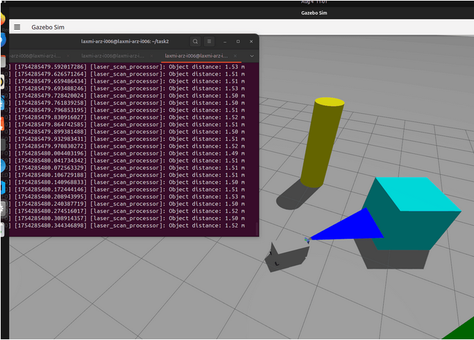

# 🐢 TortoiseBot Simulation Environment (ROS 2 Jazzy)


## 📌 Overview
This project provides a **complete simulation environment** for the **TortoiseBot mobile robot** using **ROS 2 Jazzy** and **Gazebo Harmonic**.

The repository includes:
- URDF/Xacro-based robot description
- Gazebo simulation world
- Keyboard teleoperation
- Distance from obstacles using lidar sensor
- RViz2 visualization
- Launch files for easy startup


---

## 🖥️ Prerequisites

### 🔧 System Requirements
- **Operating System**: Ubuntu 24.04 (Noble Numbat)
- **ROS 2 Distribution**: Jazzy Jalisco
- **Simulator**: Gazebo Harmonic (`gz-harmonic`)

---

### 📦 Required ROS 2 Packages

Install the required ROS 2 packages using:

```bash
sudo apt update
sudo apt install ros-jazzy-desktop
sudo apt install ros-jazzy-gazebo-ros-pkgs
sudo apt install ros-jazzy-teleop-twist-keyboard
sudo apt install ros-jazzy-robot-state-publisher
sudo apt install ros-jazzy-joint-state-publisher
sudo apt install ros-jazzy-xacro
```
Clone the repository into the source directory of your workspace 
```bash
cd ros2_ws/src
git clone https://github.com/Laxmiii77/tortoisebot-jazzy-with-lidar.git
```
Launch the gazebo world simulation with obstacles
```bash
ros2 launch my_robot_description gazebo_with_obstacles.launch.py
```
Launch the robot
```bash
ros2 launch my_robot_description robot_gazebo.launch.py
```
Run the node to read distance of objects using the lidar sensor
```bash
ros2 run laser closest_distance
```
